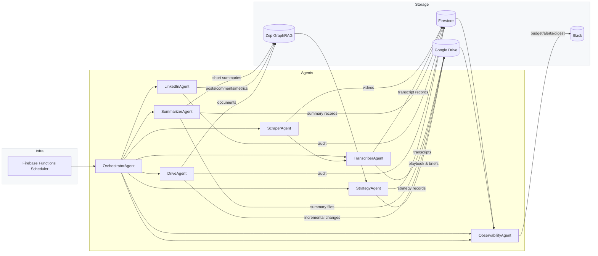

## Autopiloot Agency — Overall Architecture

```mermaid
flowchart LR
  subgraph Infra
    FCF[Firebase Functions Scheduler]
  end

  subgraph Agents
    ORC[OrchestratorAgent]
    SCR[ScraperAgent]
    TRN[TranscriberAgent]
    SUM[SummarizerAgent]
    OBS[ObservabilityAgent]
    LIN[LinkedInAgent]
    STR[StrategyAgent]
    DRV[DriveAgent]
  end

  subgraph Storage
    FS[(Firestore)]
    GD[(Google Drive)]
    ZEP[(Zep GraphRAG)]
    SLK[(Slack)]
  end

  %% Scheduling & CEO control
  FCF --> ORC
  ORC --> SCR
  ORC --> TRN
  ORC --> SUM
  ORC --> OBS
  ORC --> LIN
  ORC --> STR
  ORC --> DRV

  %% Core YouTube pipeline
  SCR -- videos --> FS
  SCR --> TRN
  TRN -- transcripts --> GD
  TRN -- transcript records --> FS
  SUM -- short summaries --> ZEP
  SUM -- summary files --> GD
  SUM -- summary records --> FS

  %% LinkedIn ingestion
  LIN -- posts/comments/metrics --> ZEP
  LIN -- audit --> FS

  %% Drive content ingestion
  DRV -- incremental changes --> GD
  DRV -- documents --> ZEP
  DRV -- audit --> FS

  %% Strategy analysis over all content sources
  ZEP --> STR
  STR -- playbook & briefs --> GD
  STR -- strategy records --> FS

  %% Observability & notifications
  FS --> OBS
  GD --> OBS
  ORC --> OBS
  OBS -- budget/alerts/digest --> SLK

  %% Daily times (implicit via FCF config)
  classDef dim fill:#f6f8fa,stroke:#d0d7de,color:#24292e;
  class Infra,Storage dim;
```
