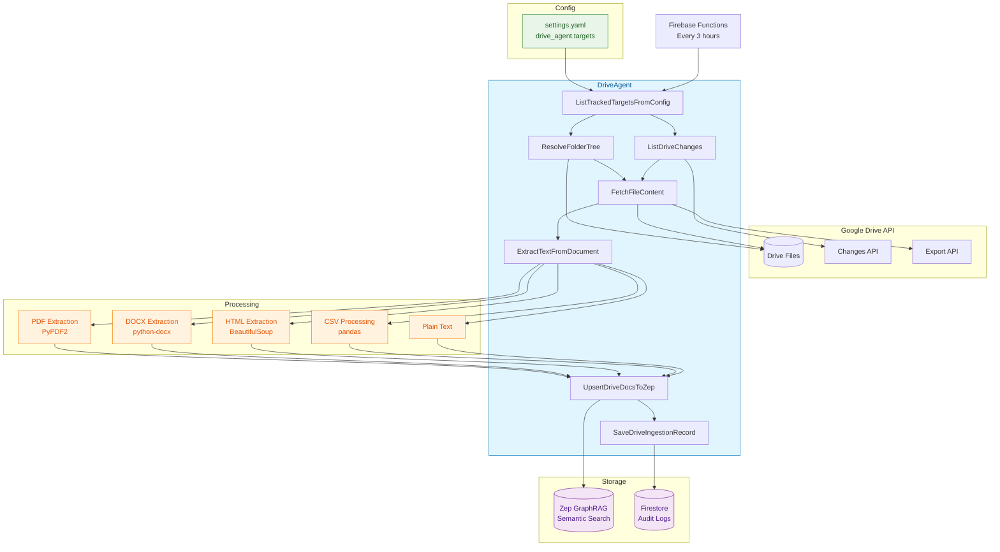

## Drive Agent — Google Drive Content Ingestion Pipeline

### Key Features

- **Incremental Processing**: Uses Google Drive Changes API with checkpoint tokens
- **Multi-Format Support**: PDF, DOCX, HTML, CSV, and plain text extraction
- **Google Workspace Integration**: Automatic export of Docs to DOCX, Sheets to CSV
- **Pattern Filtering**: fnmatch-based include/exclude patterns per target
- **Semantic Indexing**: Document chunking and Zep GraphRAG integration
- **Audit Logging**: Comprehensive Firestore logging with performance metrics
- **Scheduled Execution**: Automated 3-hour sync via Firebase Functions

### Processing Pipeline

1. **Configuration**: Load Drive targets from settings.yaml
2. **Discovery**: Resolve folder structure or detect incremental changes
3. **Fetching**: Download file content with format-specific handling
4. **Extraction**: Multi-format text extraction with encoding detection
5. **Indexing**: Document chunking and Zep GraphRAG upsert
6. **Auditing**: Comprehensive Firestore logging with metrics

### Supported Formats

- **PDF**: PyPDF2 for text extraction
- **DOCX**: python-docx for document processing
- **HTML**: BeautifulSoup for web content
- **CSV**: pandas for structured data
- **Plain Text**: Direct UTF-8 processing
- **Google Workspace**: Automatic format conversion