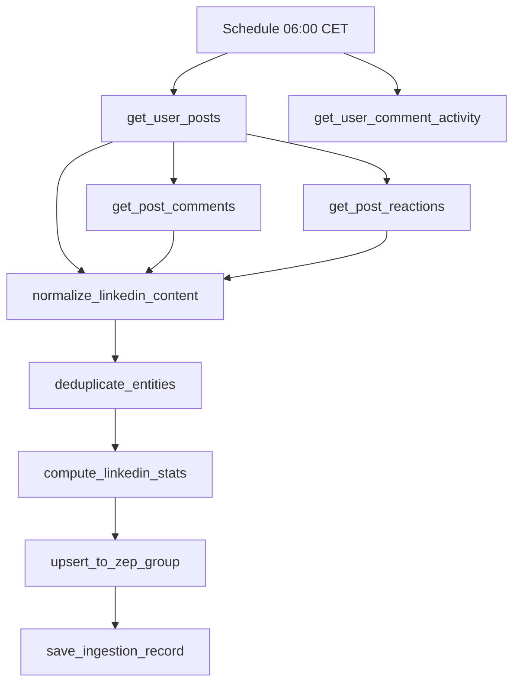

## LinkedIn Agent — Workflow

```mermaid
flowchart TD
  A[Schedule 06:00 CET] --> B[get_user_posts]
  B --> C[get_post_comments]
  B --> D[get_post_reactions]
  A --> E[get_user_comment_activity]
  B --> F[normalize_linkedin_content]
  C --> F
  D --> F
  F --> G[deduplicate_entities]
  G --> H[compute_linkedin_stats]
  H --> I[upsert_to_zep_group]
  I --> J[save_ingestion_record]
```
