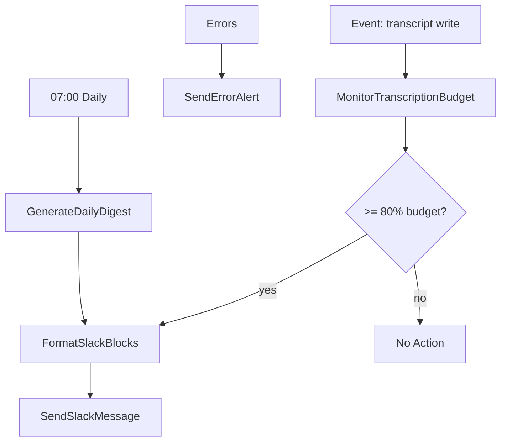

## Observability Agent — Workflow

```mermaid
flowchart TD
  A["Event: transcript write"] --> B["MonitorTranscriptionBudget"]
  B --> C{"&gt;= 80% budget?"}
  C -- yes --> D["FormatSlackBlocks"]
  D --> E["SendSlackMessage"]
  C -- no --> F["No Action"]
  G["Errors"] --> H["SendErrorAlert"]
  I["07:00 Daily"] --> J["GenerateDailyDigest"]
  J --> D
```
