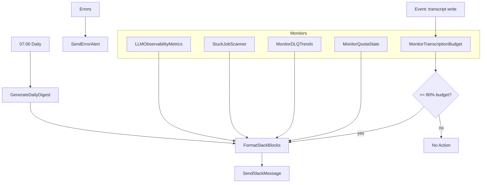

## Observability Agent — Workflow

```mermaid
flowchart TD
  subgraph Monitors
    B[MonitorTranscriptionBudget]
    Q[MonitorQuotaState]
    M[MonitorDLQTrends]
    S[StuckJobScanner]
    L[LLMObservabilityMetrics]
  end

  A["Event: transcript write"] --> B
  B --> C{"&gt;= 80% budget?"}
  C -- yes --> D[FormatSlackBlocks]
  D --> E[SendSlackMessage]
  C -- no --> F[No Action]

  Q --> D
  M --> D
  S --> D
  L --> D

  G[Errors] --> H[SendErrorAlert]
  I["07:00 Daily"] --> J[GenerateDailyDigest]
  J --> D
```
