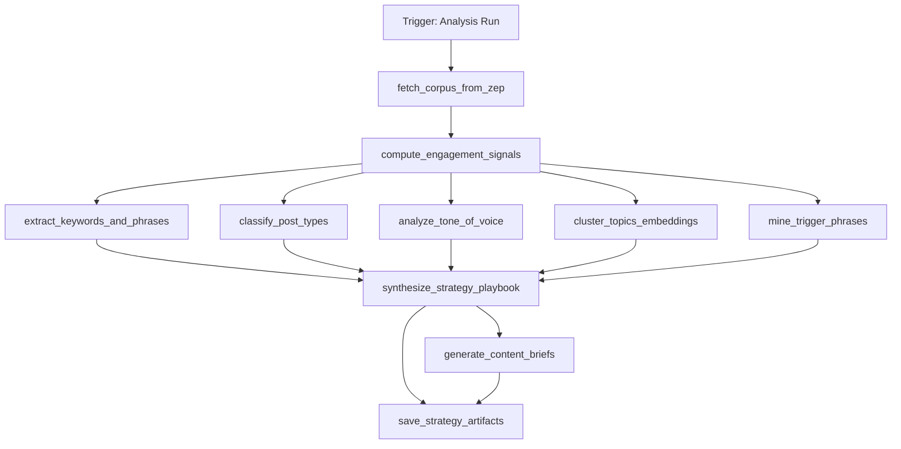

## Strategy Agent — Workflow

```mermaid
flowchart TD
  A[Trigger: Analysis Run] --> B[fetch_corpus_from_zep]
  B --> C[compute_engagement_signals]
  C --> D[extract_keywords_and_phrases]
  C --> E[classify_post_types]
  C --> F[analyze_tone_of_voice]
  C --> G[cluster_topics_embeddings]
  C --> H[mine_trigger_phrases]
  D --> I[synthesize_strategy_playbook]
  E --> I
  F --> I
  G --> I
  H --> I
  I --> J[generate_content_briefs]
  I --> K[save_strategy_artifacts]
  J --> K
```
