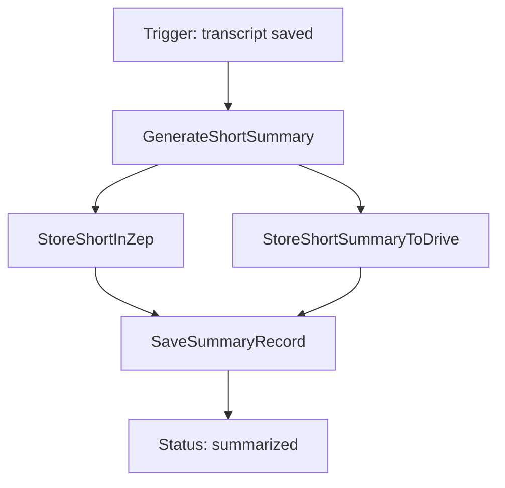

## Summarizer Agent — Workflow

```mermaid
flowchart TD
  A[Trigger: transcript saved] --> B[GenerateShortSummary]
  B --> C[StoreShortInZep]
  B --> D[StoreShortSummaryToDrive]
  C --> E[SaveSummaryRecord]
  D --> E
  E --> F[Status: summarized]
```
