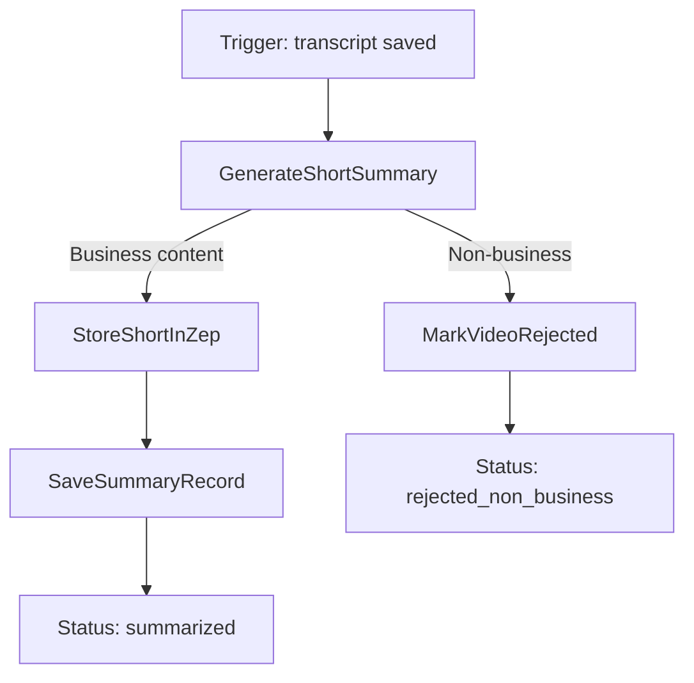

## Summarizer Agent — Workflow

```mermaid
flowchart TD
  A[Trigger: transcript saved] --> B[GenerateShortSummary]
  B -->|Business content| C[StoreShortInZep]
  B -->|Non-business| F[MarkVideoRejected]
  C --> D[SaveSummaryRecord]
  D --> E[Status: summarized]
  F --> G[Status: rejected_non_business]
```
