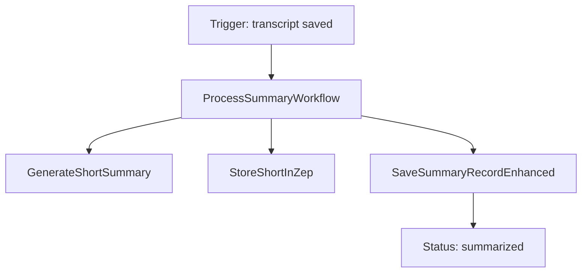

## Summarizer Agent — Workflow

```mermaid
flowchart TD
  A[Trigger: transcript saved] --> P[ProcessSummaryWorkflow]
  P --> B[GenerateShortSummary]
  P --> C[StoreShortInZep]
  P --> D[SaveSummaryRecordEnhanced]
  D --> E[Status: summarized]
```
