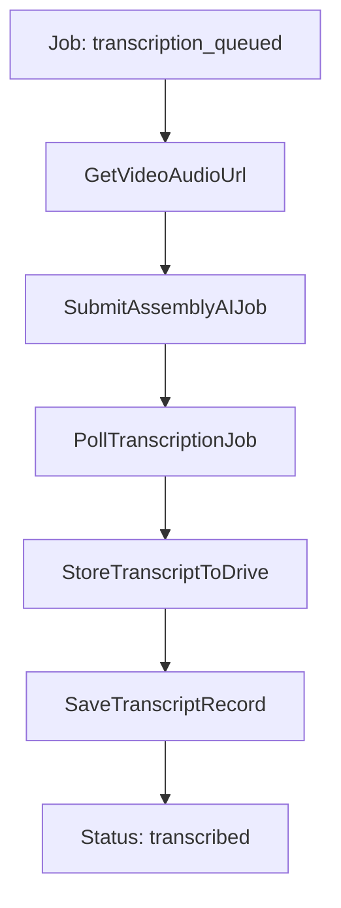

## Transcriber Agent — Workflow

```mermaid
flowchart TD
  A[Job: transcription_queued] --> B[GetVideoAudioUrl]
  B --> C[SubmitAssemblyAIJob]
  C --> D[PollTranscriptionJob]
  D --> E[StoreTranscriptToDrive]
  E --> F[SaveTranscriptRecord]
  F --> G[Status: transcribed]
```
